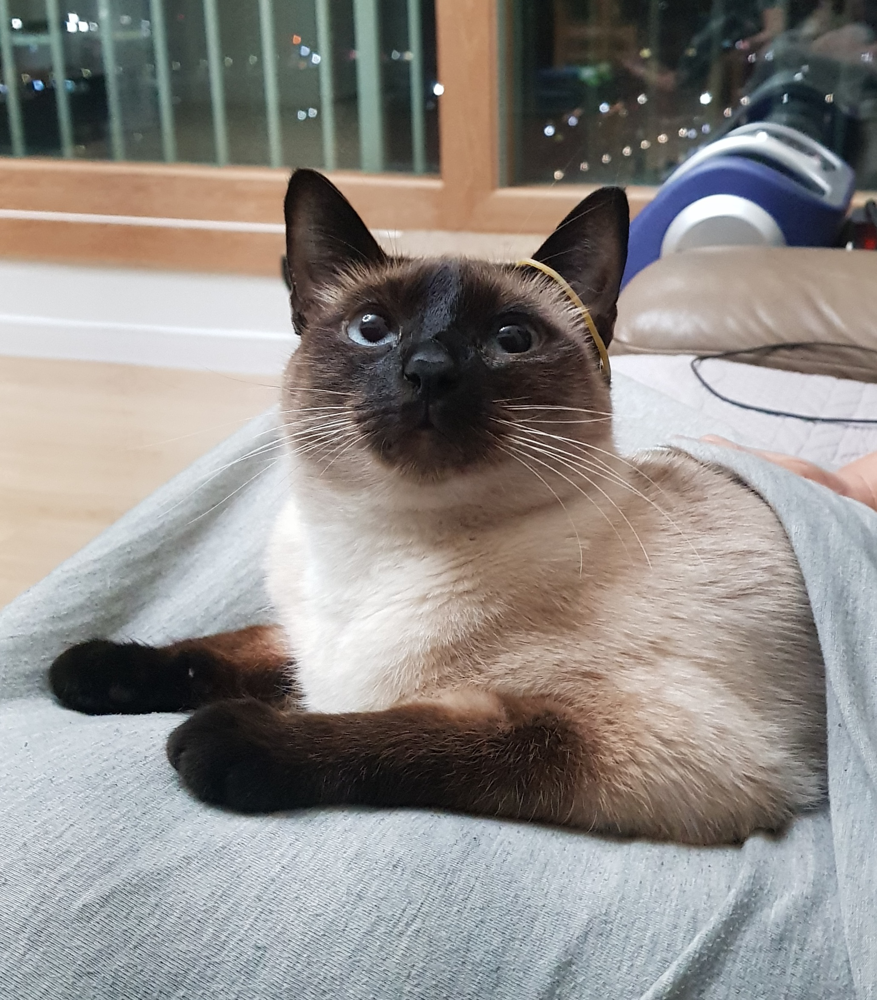
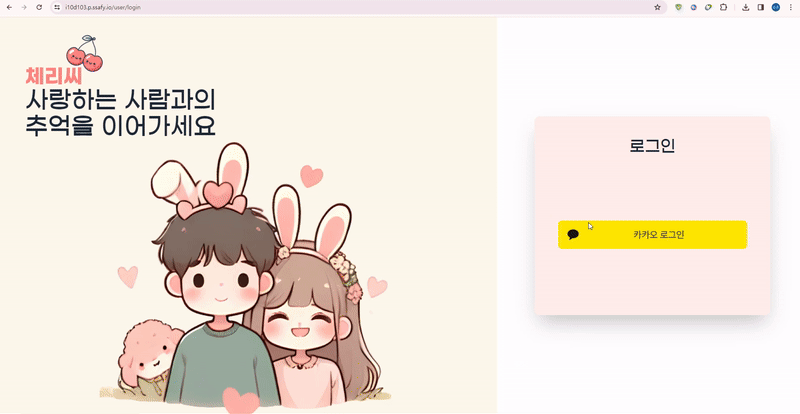
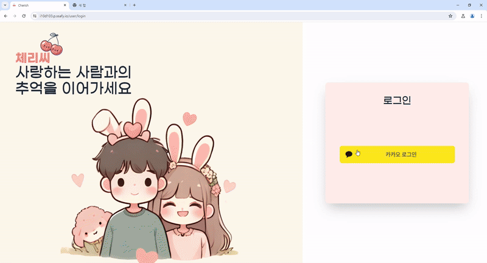
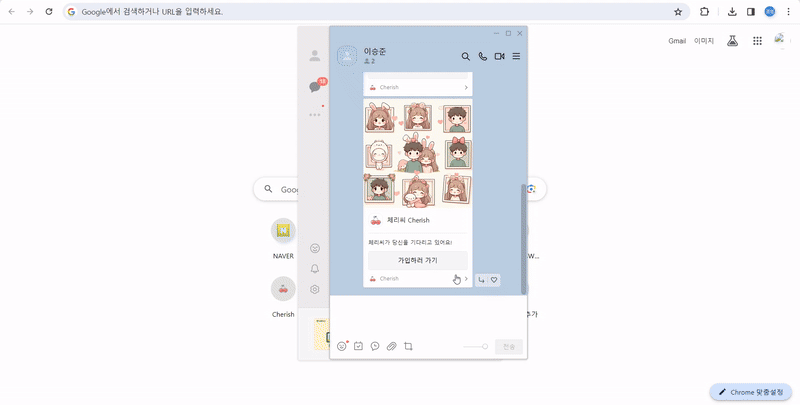
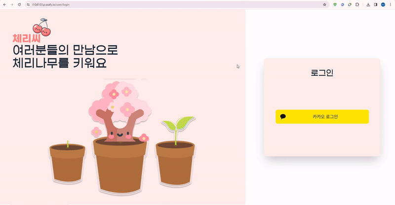
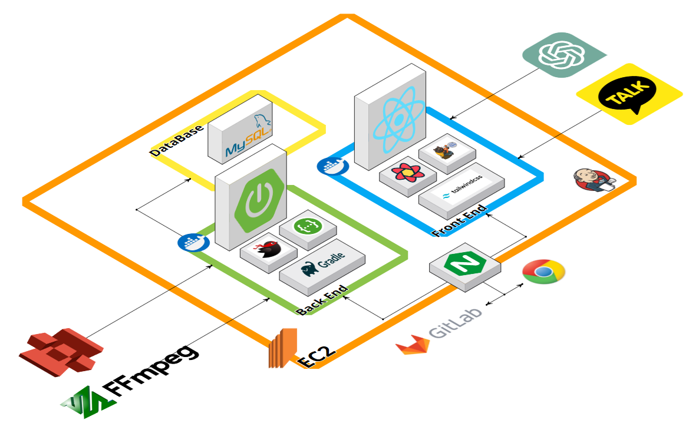
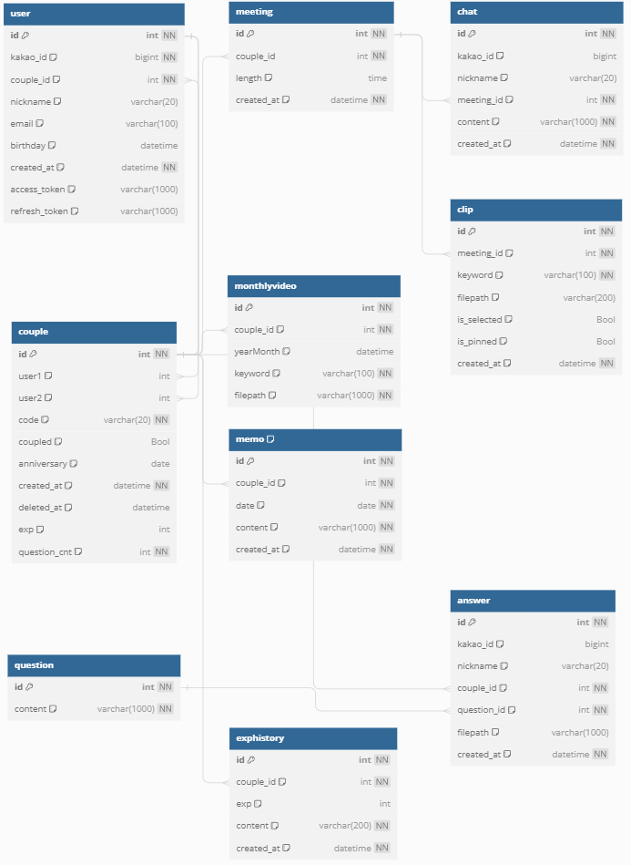

# 🍒 Cherish 🍒

---

## 💚 개요

---

**체리씨(Cherish)** 는 '소중히 여기다', '아끼다'라는 뜻으로 **장거리 커플**, 또는 **영상통화를 좋아하는 커플**이 보다 재밌고 값진 추억을 쌓을 수 있도록 **영상통화 서비스**와 함께 커플들의 행복했던 순간을 **클립으로 만들어 제공하고 보관**하는 웹서비스입니다.
 

### 기획 명세

- 대상 : 롱디(장거리) 커플, 영상통화를 좋아하는 커플

## 💚 주요기능

---

- ### 체리콜(체리톡)

  - 커플들만의 영상통화 서비스 제공
  - 영상통화 중 음성을 분석해 특정 단어가 잡히면 그 순간의 영상을 크롭하여 저장
  - 채팅 탭, 저장 된 클립을 확인하는 클립탭, 통화 내용을 실시간 확인하는 체리톡 탭 기능 제공
  - 통화 내용을 실시간으로 분석하여 특정 상황에서는 ChatGPT의 도움을 받아 답변을 해주는 서비스 제공
  - 다이어리에 해당 영상들을 저장하여 이후에 볼 수 있도록 함
     

- ### 오늘의 질문

  - 매일 커플들을 위한 질문을 제공
  - 다양한 상황에서 직접 말로 전달하지 못했던 보여줄 수 있는 기능
  - 상대가 들어오지 않아도 체리씨에서 제공하는 질문에 영상으로 답을 하여 저장
  - 상대와 자신 둘 다 같은 질문에 답을 저장하면 상대의 답을 확인할 수 있음
     

- ### 다이어리

  - 영상통화를 한 날을 표시해주고 해당 일로 들어가면 그 날에 저장된 크롭을 확인하고 다시 볼 수 있음
     

- ### 체리보관함
  - 특정 키워드로 크롭된 영상을 키워드별로 분류하여 한 달간 크롭영상 모음집을 제공
  - 이용자는 한 달간 특정 키워드로 말한 모든 순간을 하나의 영상으로 확인하며 추억을 되돌아 볼 수 있음
     

## 💚 팀 소개

---

### Frontend

|                             전찬혁 (팀장)                             |                           김경범 (FE 리더)                           |                          양원석 (FE, WebRTC)                          |
| :-------------------------------------------------------------------: | :------------------------------------------------------------------: | :-------------------------------------------------------------------: |
|  |  |  |
|           [@ChaNyeok1225](https://github.com/ChaNyeok1225)            |           [@dreamingbeom](https://github.com/dreamingbeom)           |          [@yangwonseok98](https://github.com/yangwonseok98)           |

### Backend

|                          김예현 (BE 리더)                           |                             김준엽 (BE)                             |                          이승준 (BE, Infra)                          |
| :-----------------------------------------------------------------: | :-----------------------------------------------------------------: | :------------------------------------------------------------------: |
|  |  |  |
|          [@yeaaaaahhhhh](https://github.com/yeaaaaahhhhh)           |           [@junyeop1322](https://github.com/junyeop1322)            |             [@tmdwns7809](https://github.com/tmdwns7809)             |

## 💚 개발환경

---

|  Back-end  | 버전   |   Front-end   | 버전    |  Infra  | 버전    |
| :--------: | :----- | :-----------: | :------ | :-----: | :------ |
|    JAVA    | 17.0.9 |    node.js    | 20.10.0 | AWS EC2 |         |
| SpringBoot | 3.2.1  |     React     | 18.2.0  | Docker  | 24.0.7  |
|   MySQL    | 8.0.35 | farmer-motion | 11.0.3  | Jenkins | 2.426.2 |
|  MyBatis   | 3.0.3  |  React Query  | 5.18.1  |
|            |        |    Zustand    | 4.5.0   |
|            |        | Tailwind css  | 3.4.1   |

[//]: # "|   Front-end   | 버전     | "
[//]: # "|:-------------:|:-------|"
[//]: # "|    node.js    | 20.10.0 |"
[//]: # "|     React     | 18.2.0 |"
[//]: # "| farmer-motion | 11.0.3 |"
[//]: # "|  React Query  | 5.18.1 |"
[//]: # "|    Zustand    | 4.5.0  |"
[//]: # "| Tailwind css  | 3.4.1  |"
[//]: #
[//]: # "|  Infra  | 버전      | "
[//]: # "|:-------:|:--------|"
[//]: # "| AWS EC2 |         |"
[//]: # "| Docker  | 24.0.7  |"
[//]: # "| Jenkins | 2.426.2 |"

## 💚 서비스 화면

---

### 회원가입 및 로그인

- 카카오 소셜로그인을 통해 회원가입을 진행 할 수 있습니다
- 첫 회원은 체리 코드를 생성할 수 있습니다

  

   

- 이후 생성된 체리 코드를 복사하여 연인에게 주거나 카카오톡으로 메세지를 바로 보낼 수 있습니다

  

   

- 상대방의 경우 카카오톡 메세지를 통해 홈페이지에 접속 할 수 있습니다
- 체리 코드를 입력하거나, 메세지로 자동 완성되는 체리 코드로 회원가입을 진행 할 수 있습니다

  

   

- 회원가입을 진행 한 후 다시 한 번 로그인을 눌러 로그인을 진행하여 메인페이지로 접속할 수 있습니다

  

### 체리콜(영상 통화)

- 체리콜을 클릭하여 연인과의 화상통화를 진행 할 수 있습니다
- 체리콜을 접속하여 입장 버튼을 서로가 클릭하여 준비가 완료되면 오른쪽 하단의 통화버튼이 활성화됩니다.
- 이후 활성화 된 통화 버튼을 클릭하면 연인과의 체리콜(화상통화)이 진행되며 채팅기능을 이용 할 수 있습니다

  

   

- 체리콜(화상통화) 중에 대화를 나누는 내용들은 모두 체리톡에서 확인 할 수 있으며 특정한 상황에서는 ChatGPT의 도움을 받아 다양한 대화를 이어나갈 수 있습니다.
- 예를 들어 '부산에 가서 뭐할까?'라는 대화의 주제라면, ChatGPT가 이를 인식하여 부산의 명물과 관광지를 소개합니다.

  

   

- 또한 화상통화로 대화 중 특정 키워드를 사용한 특별한 순간을 클립으로 저장하여 연인들에게 제공합니다.
- 생성 된 클립은 클립 탭에서 확인 할 수 있으며 클립영상을 클릭하면 바로 재생이 가능합니다.
- 클립은 다이어리에 저장되어 언제든지 확인 할 수 있으며 다이어리 기능을 통해 관리 할 수 있습니다

  

### 다이어리

- 메인페이지의 메모기능을 통해 상대방과의 다양한 메모내용을 주고 받을 수 있습니다
- 다이어리를 통해 매일의 기록과 영상 클립을 확인하고 관리 할 수 있습니다
- 체리콜을 진행한 날에는 보라색으로 표시되어 매일을 기록 할 수 있습니다
- 기념일에는 케이크 표시를 통해 확인 할 수 있으며 어떠한 기념일인지 다이어리에서 확인 할 수 있습니다

  

   

- 체리콜을 통해 저장된 클립영상과 채팅 기록은 다이어리에서 확인하고 재생 할 수 있습니다.
- Pin 시스템을 이용하여 원하는 영상에 Pin을 꽂으면 메인페이지 캐러셀에 즉시 재생가능한 클립영상을 보여줍니다
- 캐러셀에서 클립을 재생 할 수 있으며 원하지 않은 클립은 Pin을 빼거나 삭제 할 수 있습니다

  

### 오늘의 질문

- 매일 연인들에게 제공되는 특별한 질문을 통해 서로에게 말하지 못했던 속마음이나 다양한 이야기들을 영상으로 녹화하여 상대방에게 보여줄 수 있습니다
- 오늘의질문 탭을 클릭하여 질문에 대한 답을 영상으로 녹화 할 수 있습니다
- 상대방과 자신이 모두 질문에 답변하였을 경우에는 해당 질문에 대한 답변 영상을 확인할 수 있습니다

  

### 화분

- 커플들의 다양한 활동을 통해 커플 화분을 성장시키고 열매를 맺을 수 있습니다
- 화분페이지를 통해 현재 총 모은 클립 갯수, 체리콜을 진행한 시간을 확인 할 수 있습니다
- 이달의 성장내역을 통해 모은 화분 성장치를 확인 할 수있으며 그래프를 통해 현재 얼마나 화분이 성장하였는지 확인 할 수 있습니다

  

### 체리보관함

- 커플들이 저장하고 있는 다양한 클립 영상을 한 달간의 기록을 모아 키워드 별로 클립 영상을 합성하여 키워드별 모음집 영상을 제공합니다
- 날짜를 선택하면 그 달에 생성된 클립 영상들을 키워드별로 모아놓은 키워드별 모음집 영상을 확인 할 수 있습니다

  

## 💚 아키텍쳐 (기술스택)

---

## 💚 ERD

---

